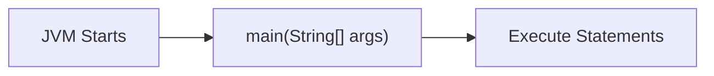
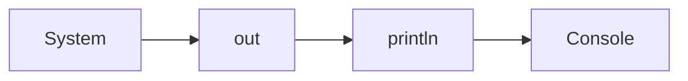
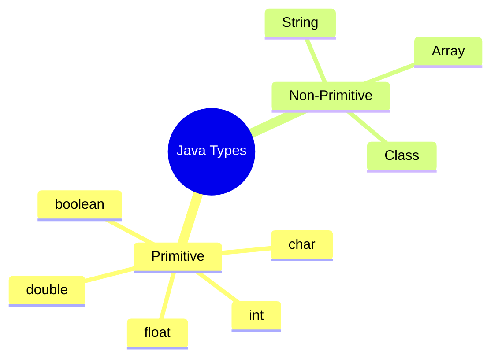
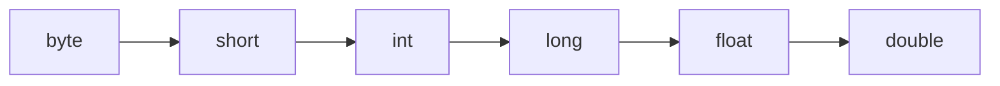
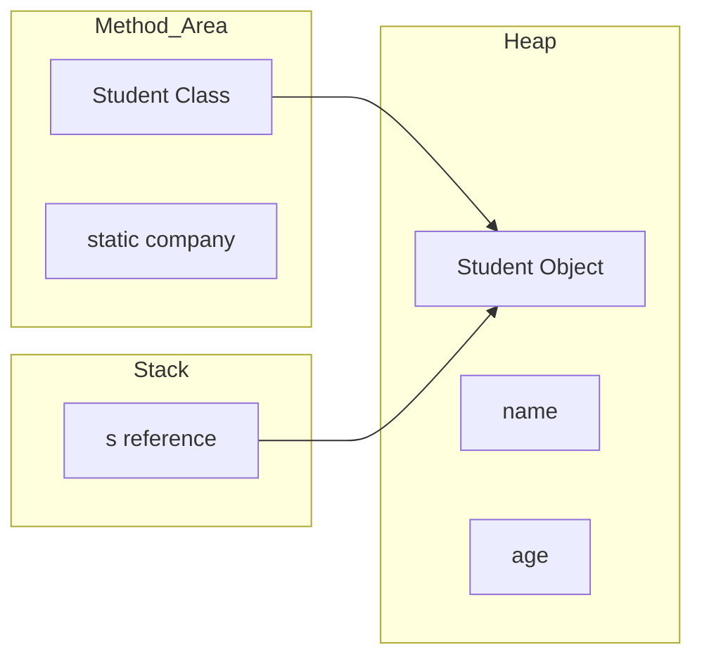

# ☕ Java Basics Notes

> A beginner-friendly reference with diagrams.

## Table of Contents
1. Basic Syntax
2. `System.out.println()`
3. Identifiers
4. Variables
5. Primitive vs Non-Primitive Types
6. Type Casting
7. Operators
8. Java Memory Model

---

# 1. Basic Syntax

```java
public class Main {
    public static void main(String[] args) {
        System.out.println("Hello World");
    }
}
```

| Keyword | Meaning |
|---|---|
| `public` | Allows the JVM to access the `main()` method. |
| `static` | Lets the JVM call `main()` without creating an object. |
| `void` | The method returns nothing. |
| `String[] args` | Stores command-line arguments. |



---

# 2. Understanding `System.out.println()`

```java
System.out.println("Hello");
```

| Part | Description |
|---|---|
| `System` | Class |
| `out` | Static object of `PrintStream` |
| `println()` | Method that prints a line |



---

# 3. Identifiers

Identifiers are names given to variables, methods, classes, enums, etc.

## Rules

- Can contain letters, digits, `_`, `$`
- Must start with a letter, `_`, or `$`
- Cannot contain spaces
- Cannot use Java keywords
- Case-sensitive

> [!TIP]
> Java uses **camelCase** for variables and methods.

Examples

```java
int firstNumber;
String studentName;
final double PI = 3.14159;
```

---

# 4. Variables

Variables store data.

| Type | Example |
|---|---|
| `int` | `25` |
| `float` | `4.5f` |
| `double` | `4.5` |
| `char` | `'A'` |
| `boolean` | `true` |
| `String` | `"Hello"` |

---

# 5. Primitive vs Non-Primitive

| Primitive | Non-Primitive |
|---|---|
| Built into Java | Created from classes |
| Stores actual value | Stores references |
| `int`, `char`, `boolean` | Arrays, Classes, Strings |



---

# 6. Implicit Type Casting

Smaller types automatically convert to larger types.

```text
byte → short → int → long → float → double
```



---

# 7. Operators

## Arithmetic

`+  -  *  /  %`

## Logical

`&&   ||   !`

## Relational

`<  >  <=  >=  ==  !=`

## Assignment

`=`

---

# 8. Java Memory Model

Java mainly uses:

| Area | Stores |
|---|---|
| Stack | Local variables, references, method calls |
| Heap | Objects |
| Method Area (Metaspace) | Class metadata, methods, static variables |

## Example

```java
class Student{
    static String company="Google";
    String name;
    int age;
}

Student s = new Student();
```

### Where everything goes

| Memory | Contents |
|---|---|
| Method Area | Student class, methods, `company` |
| Heap | Student object, `name`, `age` |
| Stack | Reference variable `s` |



## Easy Analogy

| Java Memory | Real World |
|---|---|
| Method Area | University rulebook |
| Heap | Hostel where students live |
| Stack | Reception desk holding room numbers |

> [!NOTE]
> **Objects live in the Heap.**
>
> **References live in the Stack.**
>
> **Static variables live in the Method Area.**

---

# Quick Revision

- `main()` is the entry point.
- `static` means no object required.
- Primitive types store values.
- Objects are created using `new`.
- Heap stores objects.
- Stack stores references.
- Method Area stores class information and static members.
