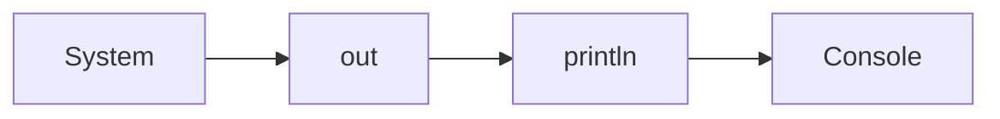
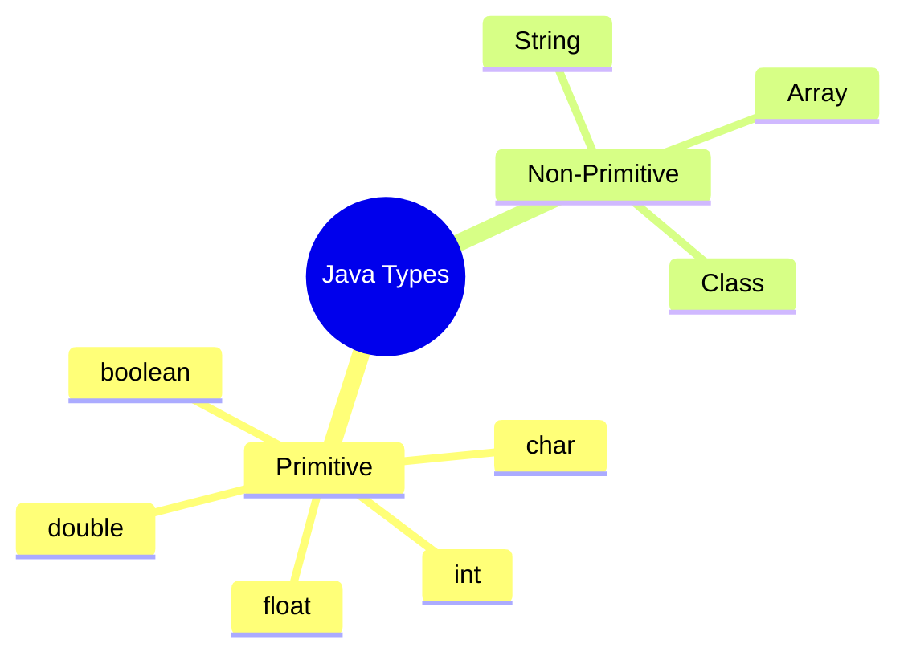
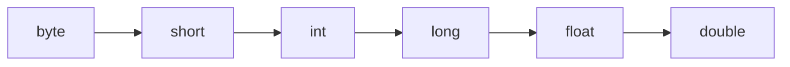
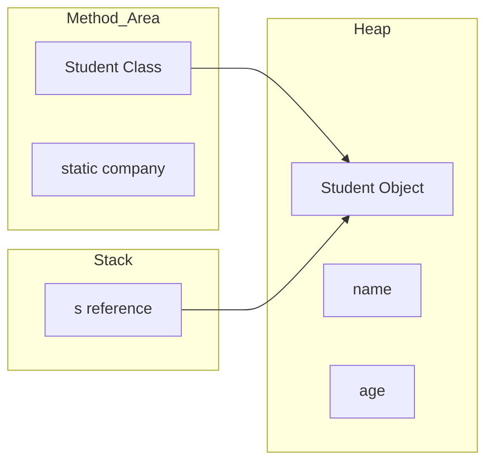
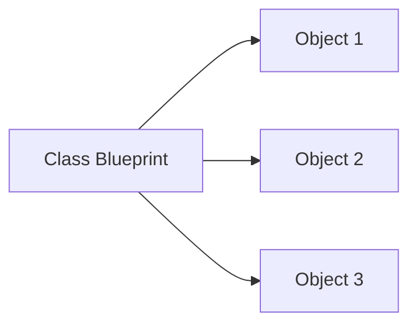
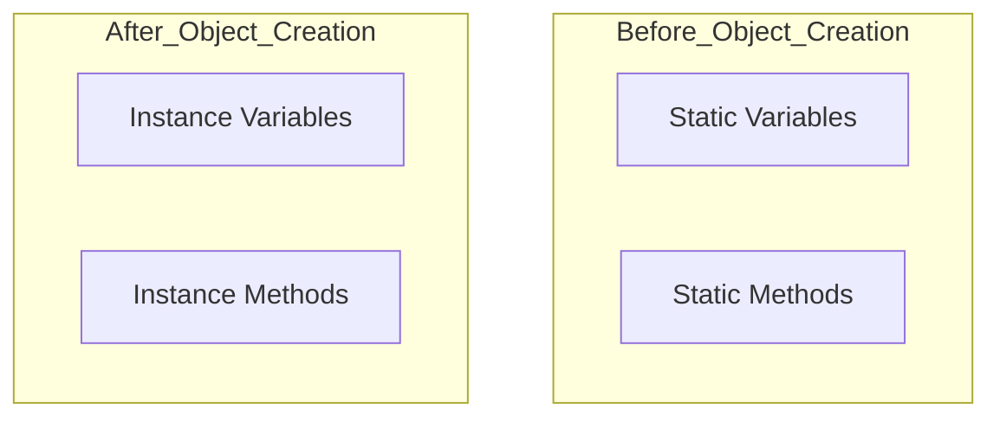
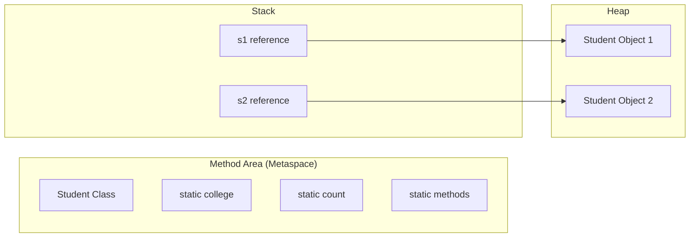

# ☕ Java Basics Notes

> A beginner-friendly reference with diagrams.

## Table of Contents
1. Basic Syntax
2. `System.out.println()`
3. Identifiers
4. Variables
5. Primitive vs Non-Primitive Types
6. Type Casting
7. Operators
8. Java Memory Model

---

# 1. Basic Syntax

```java
public class Main {
    public static void main(String[] args) {
        System.out.println("Hello World");
    }
}
```

| Keyword | Meaning |
|---|---|
| `public` | Allows the JVM to access the `main()` method. |
| `static` | Lets the JVM call `main()` without creating an object. |
| `void` | The method returns nothing. |
| `String[] args` | Stores command-line arguments. |


---

# 2. Understanding `System.out.println()`

```java
System.out.println("Hello");
```

| Part | Description |
|---|---|
| `System` | Class |
| `out` | Static object of `PrintStream` |
| `println()` | Method that prints a line |



---

# 3. Identifiers

Identifiers are names given to variables, methods, classes, enums, etc.

## Rules

- Can contain letters, digits, `_`, `$`
- Must start with a letter, `_`, or `$`
- Cannot contain spaces
- Cannot use Java keywords
- Case-sensitive

> [!TIP]
> Java uses **camelCase** for variables and methods.

Examples

```java
int firstNumber;
String studentName;
final double PI = 3.14159;
```

---

# 4. Variables

Variables store data.

| Type | Example |
|---|---|
| `int` | `25` |
| `float` | `4.5f` |
| `double` | `4.5` |
| `char` | `'A'` |
| `boolean` | `true` |
| `String` | `"Hello"` |

---

# 5. Primitive vs Non-Primitive

| Primitive | Non-Primitive |
|---|---|
| Built into Java | Created from classes |
| Stores actual value | Stores references |
| `int`, `char`, `boolean` | Arrays, Classes, Strings |



---

# 6. Implicit Type Casting

Smaller types automatically convert to larger types.

```text
byte → short → int → long → float → double
```



---

# 7. Operators

## Arithmetic

`+  -  *  /  %`

## Logical

`&&   ||   !`

## Relational

`<  >  <=  >=  ==  !=`

## Assignment

`=`

---

# 8. Java Memory Model

Java mainly uses:

| Area | Stores |
|---|---|
| Stack | Local variables, references, method calls |
| Heap | Objects |
| Method Area (Metaspace) | Class metadata, methods, static variables |

## Example

```java
class Student{
    static String company="Google";
    String name;
    int age;
}

Student s = new Student();
```

### Where everything goes

| Memory | Contents |
|---|---|
| Method Area | Student class, methods, `company` |
| Heap | Student object, `name`, `age` |
| Stack | Reference variable `s` |



## Easy Analogy

| Java Memory | Real World |
|---|---|
| Method Area | University rulebook |
| Heap | Hostel where students live |
| Stack | Reception desk holding room numbers |

> [!NOTE]
> **Objects live in the Heap.**
>
> **References live in the Stack.**
>
> **Static variables live in the Method Area.**

---

# Quick Revision

- `main()` is the entry point.
- `static` means no object required.
- Primitive types store values.
- Objects are created using `new`.
- Heap stores objects.
- Stack stores references.
- Method Area stores class information and static members.

# 9. Static vs Non-Static (Instance) Members

## The Core Idea

Java class members are of two types:

| Static Members | Non-Static (Instance) Members |
|---|---|
| Belong to the **class** | Belong to an **object** |
| One shared copy | Each object has its own copy |
| Exist before objects are created | Exist only after an object is created |

### Easy Analogy

- **Class = Blueprint**
- **Object = House built from the blueprint**

One blueprint can be used to build many houses.



---

# 10. Static Members

Static members belong to the class itself.

```java
class Student {
    static String college = "IIT Madras";
}
```

### Characteristics

- Only **one copy** exists.
- Shared by every object.
- Created when the class is loaded.
- Can be accessed without creating an object.

```java
System.out.println(Student.college);
```

Example:

```java
Student s1 = new Student();
Student s2 = new Student();
```

Both objects share the same static variable.

```text
Student
│
├── college = IIT Madras
│
├── s1
└── s2
```

Changing it:

```java
Student.college = "Harvard";
```

Now both `s1.college` and `s2.college` become `"Harvard"`.

---

# 11. Non-Static (Instance) Members

Instance members belong to each object separately.

```java
class Student {
    String name;
}
```

Example:

```java
Student s1 = new Student();
s1.name = "Amit";

Student s2 = new Student();
s2.name = "Rahul";
```

Each object stores its own copy.

---

# 12. Static Variables

```java
static int count = 0;
```

### Properties

- Belong to the class
- Only one copy exists
- Shared by all objects
- Exist before any object is created

Common uses:

- Object counters
- Configuration values
- Constants (`static final`)

---

# 13. Instance Variables

```java
String name;
int age;
```

### Properties

- Belong to objects
- Every object gets its own copy
- Created only after object creation

---

# 14. Static Methods

```java
static void hello() {
    System.out.println("Hello");
}
```

Called as:

```java
Student.hello();
```

No object is required.

Common uses:

- Utility methods
- `main()` method
- Helper methods

---

# 15. Instance Methods

```java
void introduce() {
    System.out.println(name);
}
```

Need an object.

```java
Student s = new Student();
s.introduce();
```

---

# 16. Object Creation Dependency

| Member | Depends on Object Creation? |
|---|---|
| Static Variable | ❌ No |
| Static Method | ❌ No |
| Instance Variable | ✅ Yes |
| Instance Method | ✅ Yes |



> [!TIP]
> Static members exist as soon as the class is loaded. Instance members exist only after an object is created.

---

# 17. Accessibility Rules

## Case 1: Static Method → Static Variable ✅

```java
static int x = 10;

static void show() {
    System.out.println(x);
}
```

**Reason:** Both belong to the class.

---

## Case 2: Static Method → Instance Variable ❌

```java
int y = 20;

static void show() {
    // System.out.println(y); // ERROR
}
```

**Reason:** A static method has no associated object.

Suppose:

```java
Demo d1 = new Demo();
Demo d2 = new Demo();

d1.y = 10;
d2.y = 20;
```

Which object's `y` should Java use?

Java cannot decide.

Correct:

```java
static void show() {
    Demo d = new Demo();
    System.out.println(d.y);
}
```

---

## Case 3: Static Method → Static Method ✅

```java
static void a(){}

static void b(){
    a();
}
```

---

## Case 4: Static Method → Instance Method ❌

```java
void hello(){}

static void test(){
    // hello(); // ERROR
}
```

Correct:

```java
static void test(){
    Demo d = new Demo();
    d.hello();
}
```

---

## Case 5: Instance Method → Static Variable ✅

```java
static int x = 10;

void show(){
    System.out.println(x);
}
```

---

## Case 6: Instance Method → Instance Variable ✅

```java
int y = 20;

void show(){
    System.out.println(y);
}
```

---

## Case 7: Instance Method → Static Method ✅

```java
static void hello(){}

void test(){
    hello();
}
```

---

## Case 8: Instance Method → Instance Method ✅

```java
void hello(){}

void test(){
    hello();
}
```

---

# 18. Accessibility Summary

| From ↓ / Access → | Static Variable | Instance Variable | Static Method | Instance Method |
|---|---|---|---|---|
| Static Method | ✅ | ❌ | ✅ | ❌ |
| Instance Method | ✅ | ✅ | ✅ | ✅ |

---

# 19. Why Static Methods Cannot Access Instance Members Directly

Instance members belong to objects.

Suppose:

```java
Demo d1 = new Demo();
Demo d2 = new Demo();

d1.y = 10;
d2.y = 20;
```

Now execute:

```java
show();
```

If `show()` is static, Java has no associated object.

Which value should it use?

- `10`?
- `20`?

There is no object reference.

Therefore, Java reports a **compile-time error**.

---

# 20. The `this` Keyword

Every instance method has an implicit object reference called `this`.

```java
void introduce(){
    System.out.println(this.name);
}
```

Static methods do **not** have `this`.

```java
static void hello(){
    // this.name; // ERROR
}
```

---

# 21. Memory Diagram



> [!NOTE]
>
> - Static members are stored once in the **Method Area (Metaspace)**.
> - Objects are stored in the **Heap**.
> - References are stored in the **Stack**.

---

# 22. Common Interview Questions

### Why is `main()` static?

Because the JVM must call it without creating an object.

### Can static methods be overridden?

No. They are **hidden**, not overridden.

### Can constructors be static?

No. Constructors create objects.

### Can static methods access instance variables directly?

No.

### Can instance methods access static members?

Yes.

### Can static variables be accessed through objects?

Yes, but it is discouraged.

Preferred:

```java
Student.college;
```

Instead of:

```java
student.college;
```

---

# Quick Revision

- Static members belong to the class.
- Instance members belong to objects.
- Static members exist before object creation.
- Instance members exist only after object creation.
- One static copy is shared by all objects.
- Every object has its own instance members.
- Static methods cannot directly access instance members.
- Instance methods can access both static and instance members.
- `main()` is static because the JVM calls it without creating an object.
- `this` exists only inside instance methods.